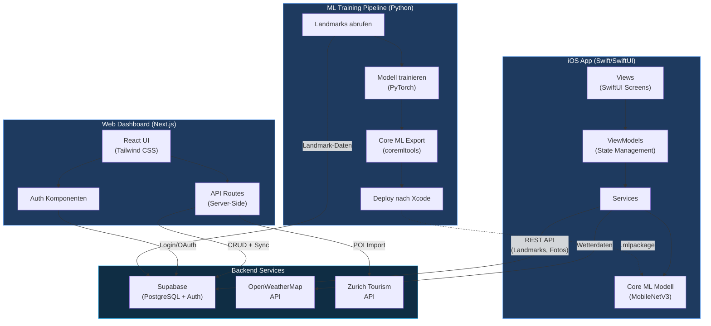
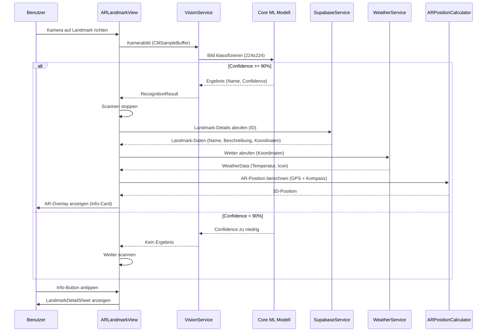
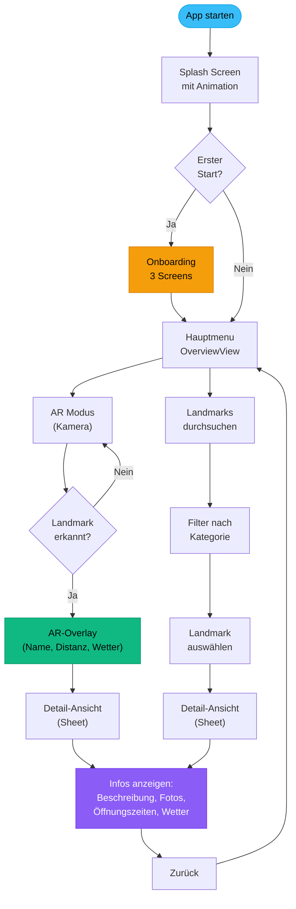
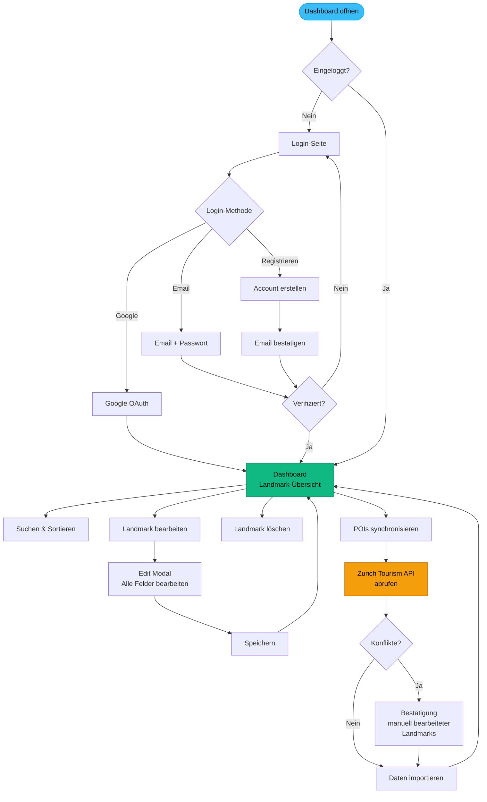
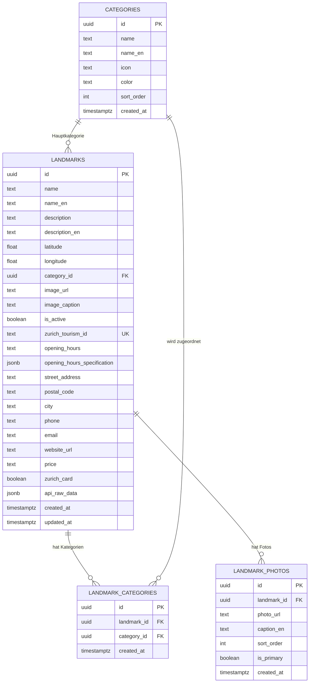
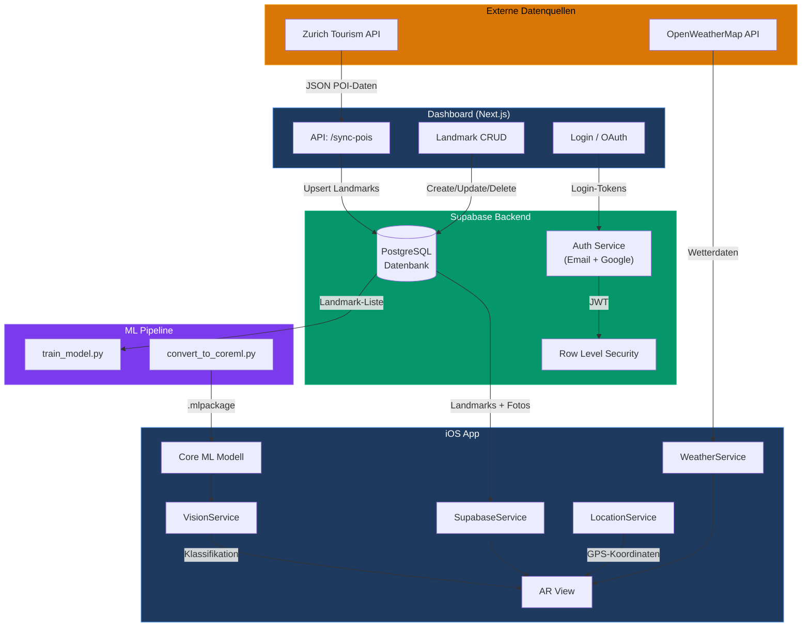
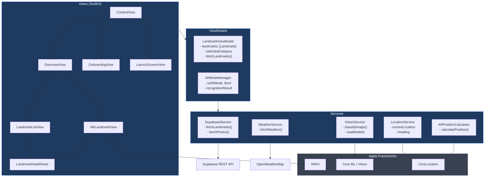
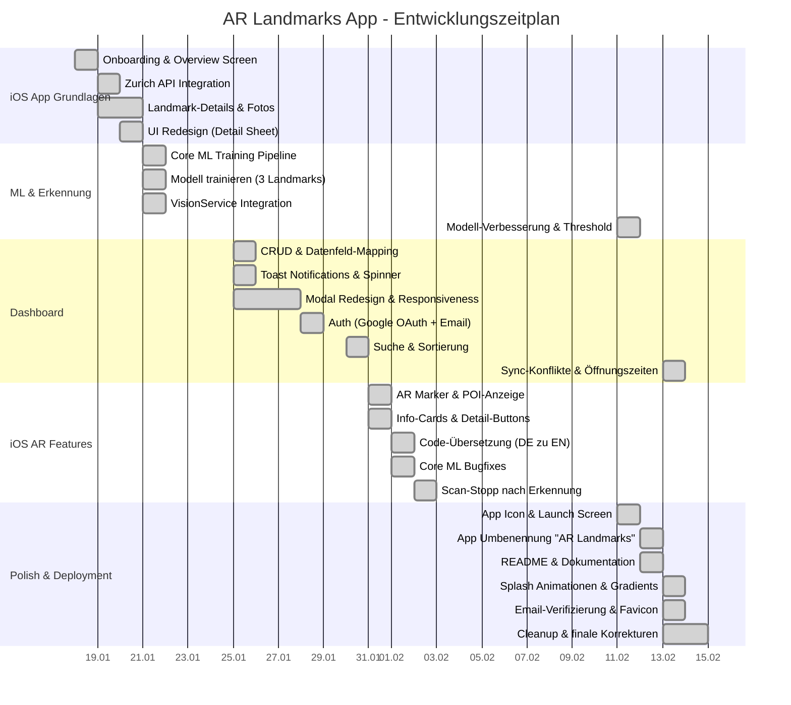
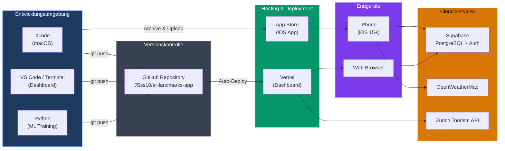

# AR Landmarks App - Diagramme

Diese Datei enthält Mermaid-Diagramme zur Dokumentation der Architektur, Abläufe und Meilensteine des Projekts.

---

## 1. Systemarchitektur (Strukturdiagramm)

Zeigt die drei Hauptkomponenten des Projekts und deren Verbindungen.

---

## 2. AR-Erkennungs-Ablauf (Sequenzdiagramm)

Beschreibt den Ablauf der Landmark-Erkennung in der iOS-App von der Kameraaufnahme bis zur AR-Anzeige.

---

## 3. User Journey (Benutzer-Ablauf)

Zeigt den vollständigen Benutzerfluss durch die iOS-App.

---

## 4. Dashboard-Ablauf (Web)

Zeigt den Ablauf im Web-Dashboard zur Verwaltung der Landmarks.

---

## 5. ML-Training-Pipeline (Ablaufdiagramm)

Beschreibt den vollständigen Prozess zum Trainieren und Deployen des Erkennungsmodells.

```mermaid
flowchart LR
    subgraph Vorbereitung["1. Vorbereitung"]
        A1["Landmarks aus<br/>Supabase abrufen<br/>(fetch_landmarks.py)"]
        A2["Trainingsbilder sammeln<br/>(20-50 pro Landmark)"]
        A3["Bilder in Ordner<br/>sortieren<br/>(data/train/)"]
    end

    subgraph Training["2. Training"]
        B1["MobileNetV3-Small<br/>laden"]
        B2["Transfer Learning<br/>(Feature Extraction)"]
        B3["Trainieren<br/>(train_model.py)"]
        B4["Validierung &<br/>Metriken"]
    end

    subgraph Export["3. Export & Deploy"]
        C1["PyTorch zu Core ML<br/>konvertieren<br/>(convert_to_coreml.py)"]
        C2[".mlpackage nach<br/>Xcode kopieren"]
        C3["VisionService.swift<br/>Class-Mapping<br/>aktualisieren"]
    end

    A1 --> A2 --> A3 --> B1
    B1 --> B2 --> B3 --> B4
    B4 --> C1 --> C2 --> C3

    style Vorbereitung fill:#1E3A5F,stroke:#60A5FA,color:#fff
    style Training fill:#1E3A5F,stroke:#60A5FA,color:#fff
    style Export fill:#1E3A5F,stroke:#60A5FA,color:#fff
```

---

## 6. Datenmodell (Entity-Relationship-Diagramm)

Zeigt die Datenbankstruktur in Supabase (PostgreSQL).

---

## 7. Datenfluss zwischen Komponenten

Zeigt wie Daten zwischen allen Systemkomponenten fliessen.

---

## 8. iOS App - Architektur (MVVM)

Detaillierte Darstellung der iOS-App-Schichten nach dem MVVM-Muster.

---

## 9. Projekt-Meilensteine (Gantt-Diagramm)

Zeigt die zeitliche Entwicklung des Projekts basierend auf der Git-Historie.

---

## 10. Deployment-Architektur

Zeigt die Deployment-Infrastruktur des Projekts.

---

## Hinweise

- Alle Diagramme sind im [Mermaid](https://mermaid.js.org/)-Format erstellt.
- Sie können direkt auf GitHub gerendert werden (GitHub unterstützt Mermaid nativ).
- Zur lokalen Vorschau kann der [Mermaid Live Editor](https://mermaid.live/) verwendet werden.
- Alternativ können VS Code Extensions wie "Markdown Preview Mermaid Support" genutzt werden.
